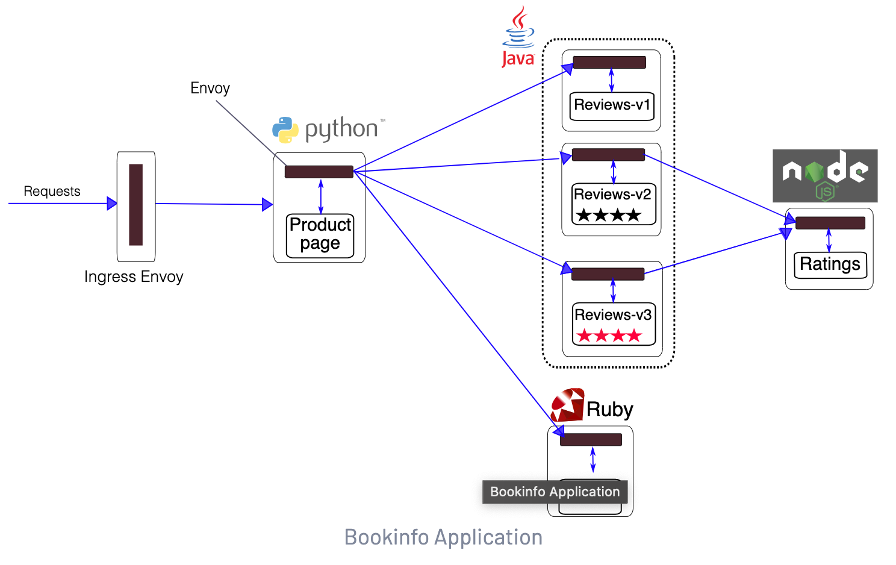
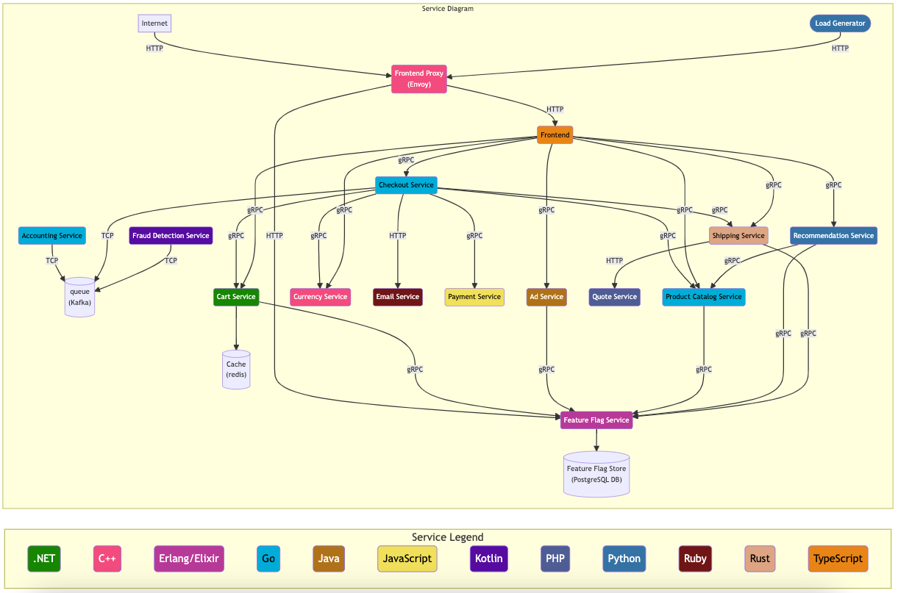
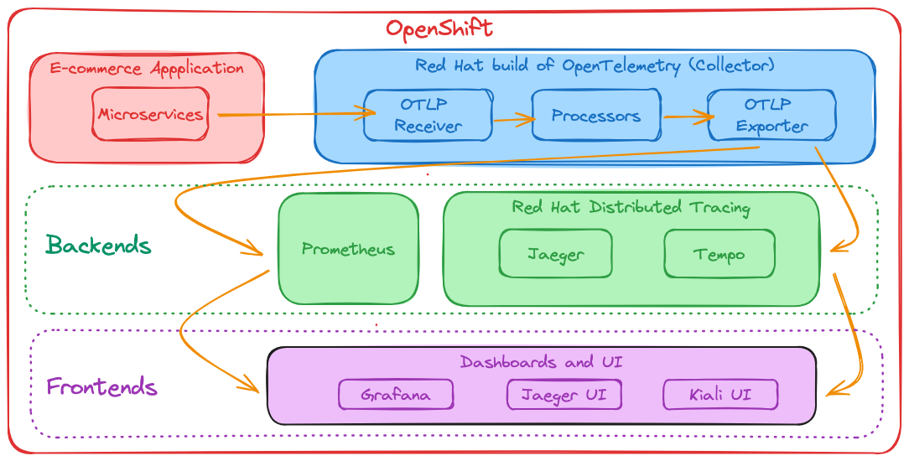
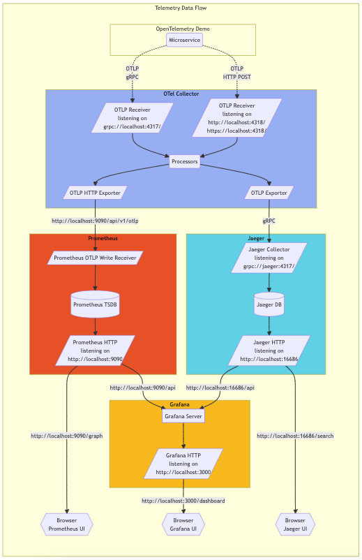
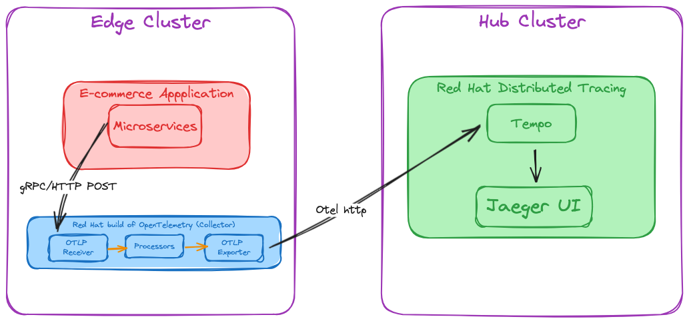
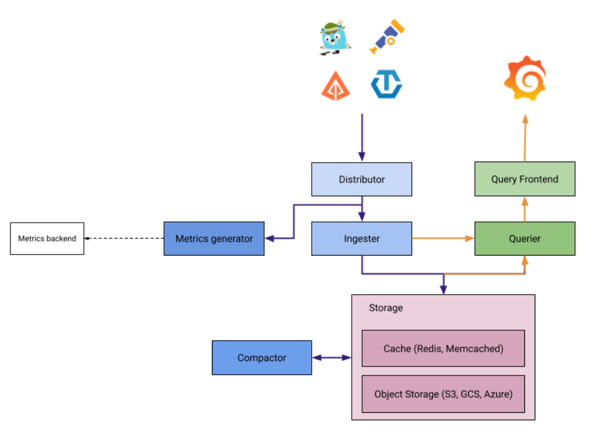

# openshift-observability

## Env
Tested on OpenShift 4.14

## Demo for service mesh
#### Distributed Tracing

1. All required manifests are in servicemesh folder
2. Jaeger and Kali are deployed as part of Service Mesh
3. Control Plane(Istio, Kiali, Jaeger) is in bookinfo-mesh namespace 
4. Application is in bookinfo namespace
5. Once deployed refresh producpage
   1. Get routes (App/Kiali/Jaeger) from `bookinfo-mesh` namespace
      1. Navigate to `topology` in `Developer View`
   2. For App
      1. Route is istio-ingressgateway
      2. Use http instead of https
      3. append /productpage at the end
      4. e.g. `http://bookinfo-bookinfo-gateway-684888c0ebb17f37-bookinfo-mesh.apps.cluster-vdfs9.dynamic.redhatworkshops.io/productpage`
      5. Refresh to create traces
   3. Observer traces in Kiali and Jaeger dashboards
#### Observavility 
1. In administrator view
   1. Observe -> Dashboards
   2. Select
      1. Dashboard: Kubernetes/Conpute Resource/Namespace (Workloads)
      2. NameSpace: Bookinfo
      3. Type: Deployment

# Edge/Hub demo for RH1 - Using Otel and Tempo
Demo Application is made up of several microservices writtern in various languages, using differint protocols.

### For single cluster scenerio
Overview

Detailed

### For Hub/edge scenerio
Otel will be on edge and Temp of Hub

## Demo for opentelemetry
1.  Login to edge openshift cluster
2.  Go to opentelemetry folder
3.  my-values-file.yaml
       1. Opentelemetry Collector can be set here
       2. I have set exporter as 
          1. tempo in hub cluster 
          2. jaeger that is deployed as part of demo app
          3. local tempo, (commented out)
 4. Run ./demo.sh
    1. Namespace can be changed. default is opentelemetry-demo
    2. Demo application that is instrumented to emit telemetry will be deployed
    3. it creates and set service account scc, it is neccessary for Openshift
    4. Also patches grafana deployment to remove securityContext, it is neccessary for Openshift
    5. If you change `my-values-file.yaml` then you can update helm deployment by running `helm upgrade my-otel-demo open-telemetry/opentelemetry-demo --values my-values-file.yaml`

## Demo for  Tempo
In our case Otel will send traces to Distributer and our query Frontend is Jauger UI

1. Make sure ODF is operator is installed properly. We need to use s3 storage
2. Go to `tempo` folder
3. Login to hub cluster
4. Run demo.sh explanation
   1. Creates namespace `tracing-system`
   2. Deploy tempo operator
   3. Creates ObjectBucketClaim
   4. Creates `s3-secret` needed for TempStack
   5. Creates TempoStack
   6. Creates route so edge can send traces to it.
5. View Traces in Jaeger dashboard provided by Tempo
